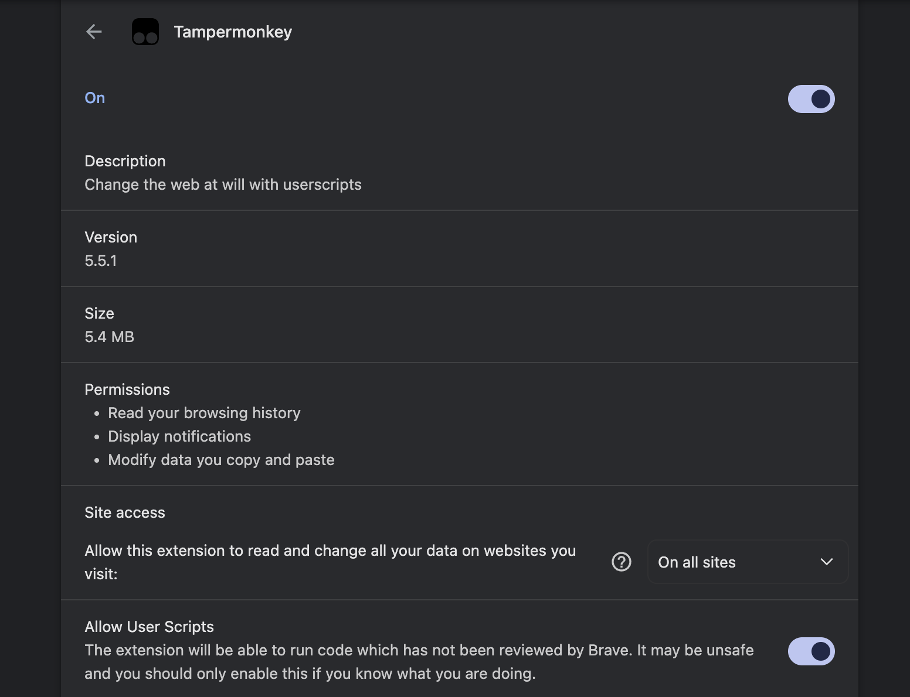

# Del-Discord

[![Version: v2.1.1][version-badge]][script]
[![License: MIT][license-badge]][license]

[![Install from Greasy Fork][greasyfork-button]][greasyfork] [![Manual Script][manual-button]][script]

[![Installation Help][help-button]](#installation-help)

---

## Demo

[![Del-Discord demo showing message cleanup and reaction removal][demo-preview]][demo-video]

---

## Installation Guide

### 1. Install a userscript manager

Skip this step if you already have one installed.

| Browser | Userscript manager |
| :--- | :--- |
| Chrome / Brave | [Tampermonkey][tampermonkey] or [Violentmonkey][violentmonkey] |
| Firefox | [Greasemonkey][greasemonkey], [Tampermonkey][tampermonkey], or [Violentmonkey][violentmonkey] |
| Edge | [Tampermonkey][tampermonkey] |

### 2. Get the script

[![Install from Greasy Fork][greasyfork-button]][greasyfork] [![Manual Script][manual-button]][script]

### 3. Confirm installation

Confirm installation in your userscript manager and enable Del-Discord.

**Manual alternative:** Open [Del-Discord-v1.user.js][script] and copy the complete script; select <kbd>Raw</kbd> if viewing it on GitHub. In your manager, select <kbd>Create a new script</kbd>, replace the default contents, and <kbd>Save</kbd>.

Enable "Allow User Scripts" (if you've never used a userscript manager)

### 4. Open Discord & check the toolbar

Open **[Discord][discord] in your browser**, refresh, and enter a DM or channel. This installation supports the Discord website; the desktop app is not supported.

Look for the <kbd>🗑️</kbd> button in the channel header. Open it to access Messages, Reactions, Queue, and DM History in one window.

---

## Installation help

| If… | Try… |
| :--- | :--- |
| The buttons do not appear | Enable the manager and Del-Discord, allow access to Discord, then refresh. |
| Your browser blocks userscripts | Enable the extension's userscript permission when prompted. |
| Duplicate buttons appear | Disable overlapping Discord scripts, then refresh. |
| You want to update | Check for updates in your userscript manager, or replace a manually installed copy with the new complete userscript and save. |

Still having installation trouble? [Open an installation bug report][bug-report]. Include your browser, manager, and script version; leave account tokens and private messages out of reports.

---

[version-badge]: https://img.shields.io/badge/version-v2.1.1-5865F2?style=flat-square
[license-badge]: https://img.shields.io/badge/license-MIT-22C55E?style=flat-square
[greasyfork-button]: ./.github/assets/install-greasyfork.svg
[manual-button]: ./.github/assets/manual-script.svg
[help-button]: ./.github/assets/installation-help.svg
[script]: ./dist/Del-Discord-v1.user.js
[license]: ./LICENSE
[discord]: https://discord.com/channels/@me
[greasyfork]: https://greasyfork.org/en/scripts/599469-del-discord
[demo-preview]: ./.github/assets/demo.gif
[demo-video]: ./.github/assets/demo.mp4
[tampermonkey]: https://www.tampermonkey.net/
[violentmonkey]: https://violentmonkey.github.io/
[greasemonkey]: https://addons.mozilla.org/firefox/addon/greasemonkey/
[bug-report]: https://github.com/zhomander/del-discord/issues/new?template=bugreport.yml

> [!WARNING]
> Del-Discord automates actions on your user account. Discord prohibits this type of automation (self-bots), and using it may result in account suspension or termination. Randomized delays do not guarantee protection from detection. Read [Discord’s self-bot policy](https://support.discord.com/hc/en-us/articles/115002192352-Automated-User-Accounts-Self-Bots) before installing. Use at your own risk.
